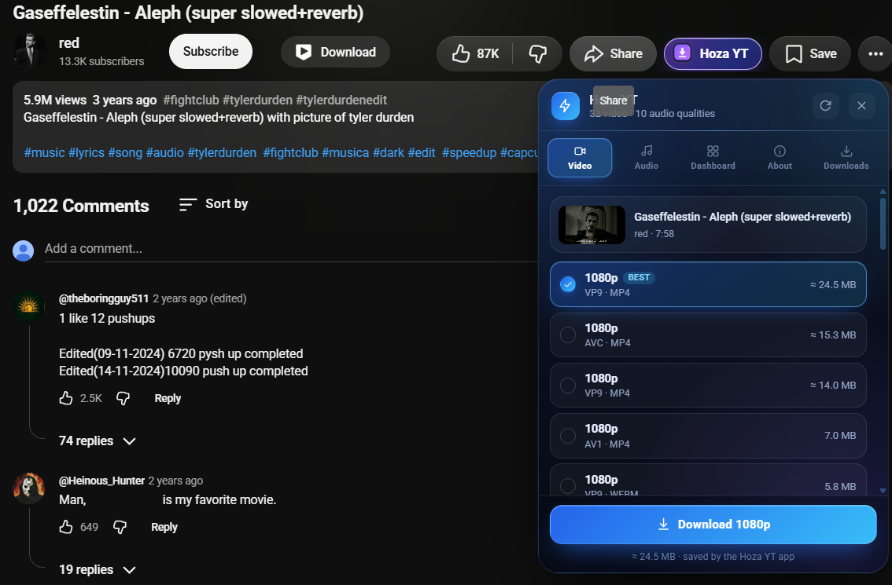
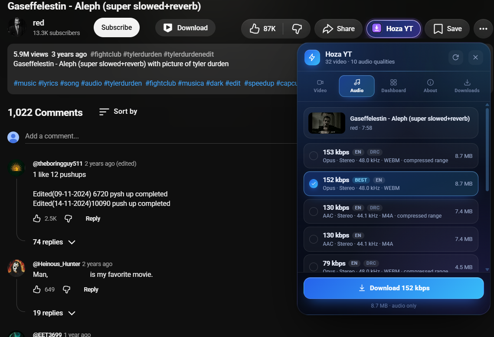
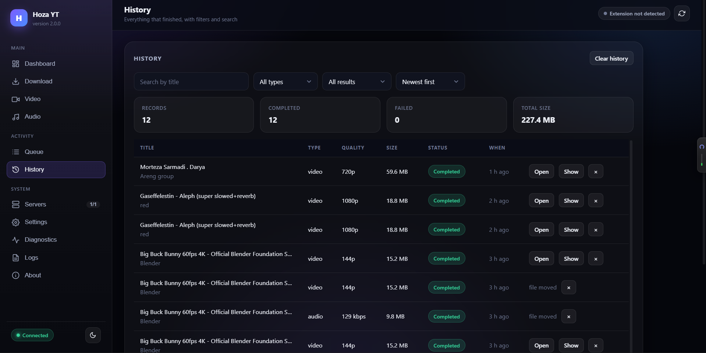

# Hoza YT

There are three things in this folder. You use two of them, once each.

| | | |
|---|---|---|
| **1** | `HozaYT-Setup.exe` | Install the app — double-click it |
| **2** | `Chrome-Extension\` | Add to Chrome — point Chrome at this folder |
| **3** | `Project-Files\` | The source code. Nothing here needs touching. |



---

## Step 1 — Install the app

Double-click **`HozaYT-Setup.exe`**.

That is the entire step. The installer connects Hoza YT to your browser, starts
the engine, and checks that the two can talk before it says it succeeded.

From then on the app runs itself. It starts whenever the extension needs it and
stops when it doesn't. There is no window to leave open, no port to pick, no
terminal, and nothing to configure. If you are ever told to launch something by
hand, that is a fault in the install — not a step anyone forgot.

## Step 2 — Add the extension to Chrome

Chrome has no other way to accept an extension that isn't on the Web Store, so
this one part is manual.

1. Open Chrome and go to **`chrome://extensions`**
2. Turn on **Developer mode** — the switch at the top right
3. Click **Load unpacked**
4. Select the **`Chrome-Extension`** folder — the folder itself. Don't open it
   and pick something inside.
5. Click the puzzle-piece icon in the toolbar and pin **Hoza YT** so it stays
   visible

The extension's ID is always `jjmmjiadjloechcbjnjogkobifmkegeh`. That is fixed
on purpose: it's what lets the installer connect the app to it in advance.

## That's it

Open a video page and click the Hoza YT icon.

If the panel ever says the app isn't running, open **Hoza YT** from the Start
menu and press **Try again**. After a normal install it shouldn't need asking.

---

## What you get

The panel lists what the page actually offers — every resolution and every
audio track, with real file sizes. Nothing is guessed, and nothing is
substituted when the download starts.

The picture at the top is the video picker. Audio works the same way, with the
bitrate, codec and language of every track the source publishes:



Anything that isn't YouTube goes through the dashboard: paste a link, analyse
it, pick a quality.


Everything you have downloaded is listed with its size and result, and the
files stay on your computer.



The dashboard opens by itself from the panel's **Dashboard** tab — it runs on
your own machine, at `127.0.0.1`, and nothing leaves it.

---

## 3 — `Project-Files\`

The source. You only need this to change or rebuild Hoza YT.

| | |
|---|---|
| `src\` | The extension's source. `Chrome-Extension\` is built from it — edit here, never there. |
| `server\` | The local backend: analysis, the queue, the dashboard, the API. |
| `native-host\` | The `hozayt` package the app runs — native messaging, supervisor, port negotiation, browser registration. |
| `build\` | `build.py` builds everything; `release.py` stages the hand-out folder. |
| `installer\` | The Inno Setup script that becomes `HozaYT-Setup.exe`. |
| `icons\`, `docs\` | Source icons and documentation. |

`Project-Files\PROJECT-MAP.md` explains all of it in more detail, and
`Project-Files\README.md` is the full manual — features, quality guide,
dashboard API, troubleshooting.

To rebuild both of the items above from source:

```
cd Project-Files
python build\build.py
```

That writes `dist\release\`, containing the same two things you see here.

### Note

`Project-Files\dist\` is not included — it's build output, and the only two
pieces of it that matter are already the first two items in this folder. It
comes back the moment you run the build.
