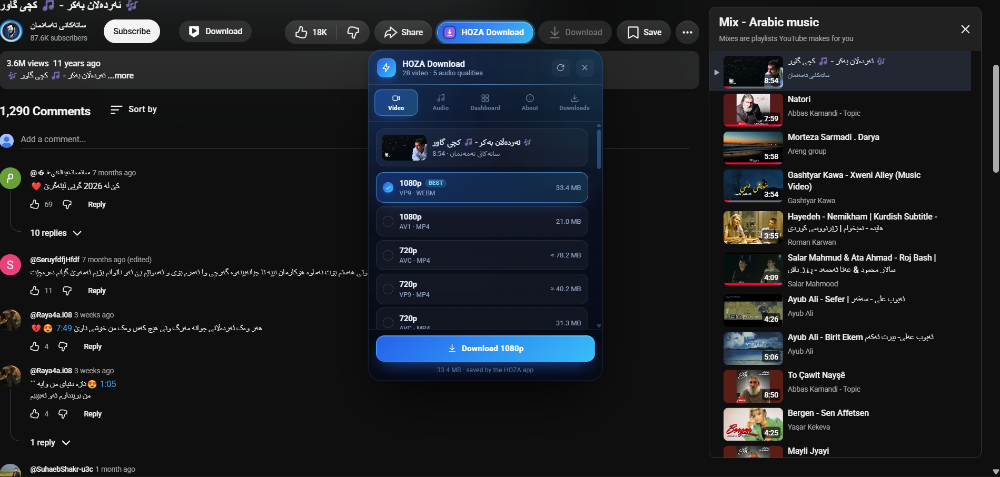
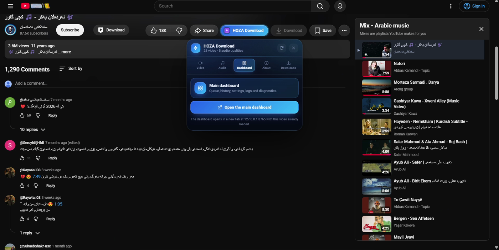
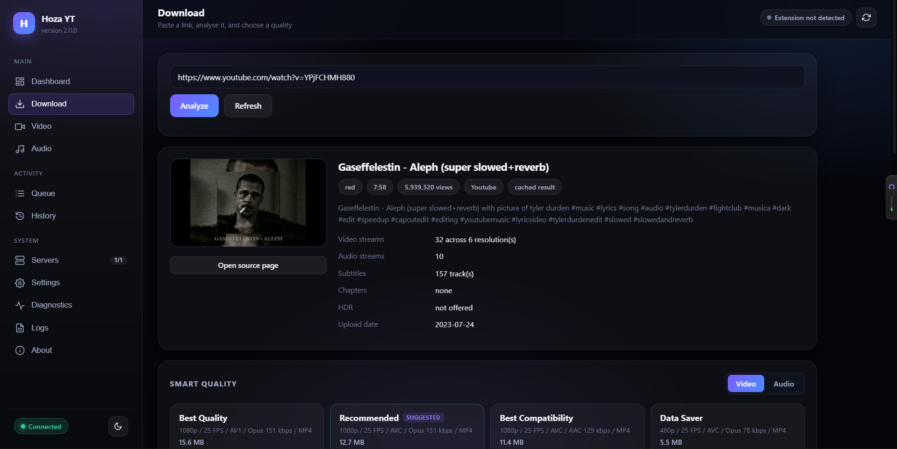
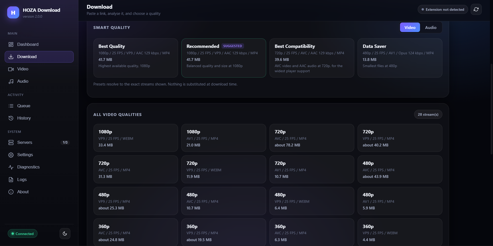
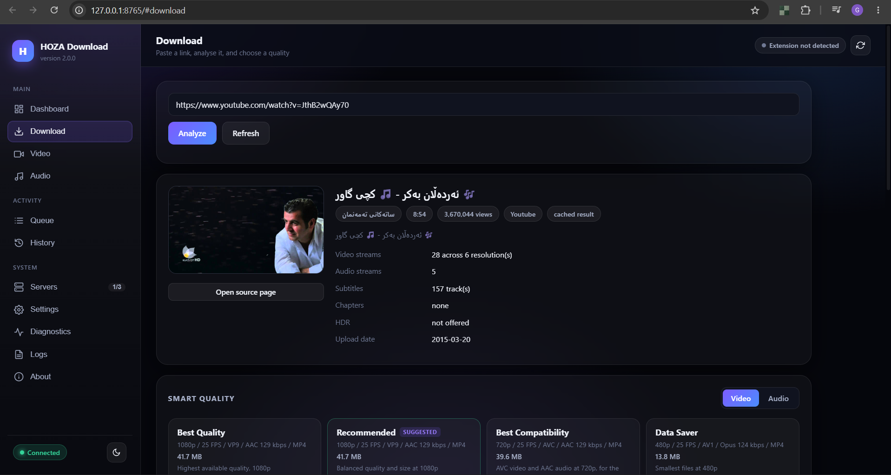
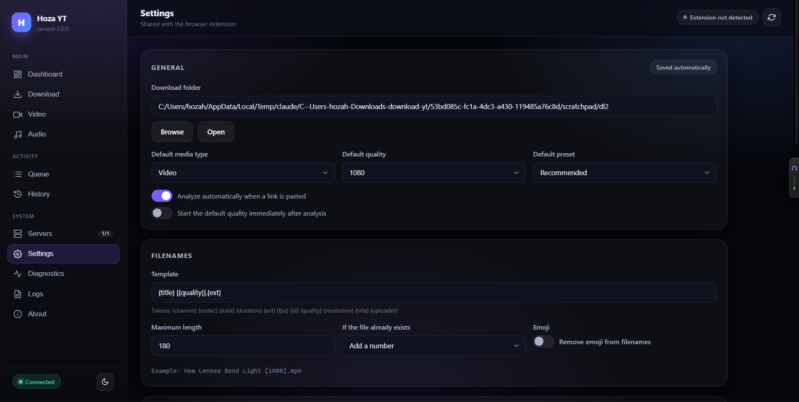
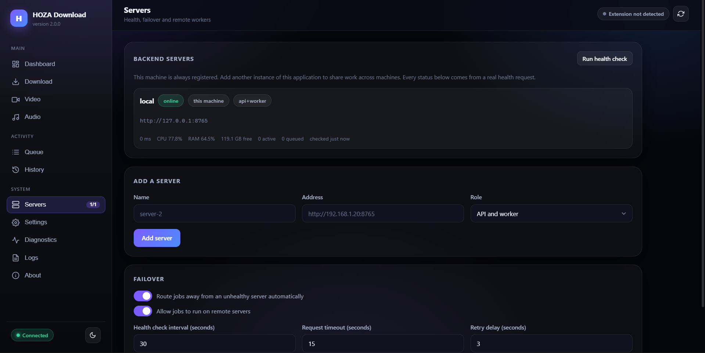
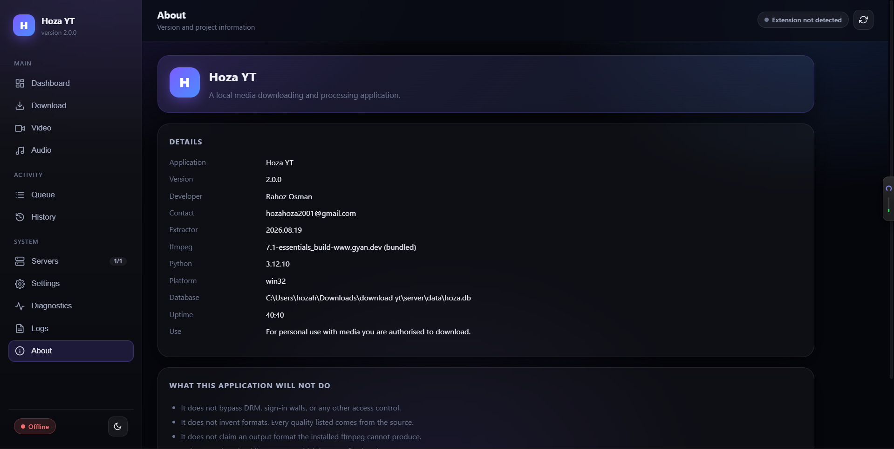

# Hoza YT v3

A local-first browser extension and media dashboard for downloading media that a page openly exposes. Hoza YT shows the formats a source actually offers, keeps downloads on your device, and does not bypass DRM, paywalls, sign-in walls, or other access controls.

<p align="center">
  
  
  
  
</p>

## Screenshots

### YouTube panel

The Hoza YT button appears beside YouTube actions. The panel keeps video and audio choices separate, shows real codecs and sizes, and lets you download the selected quality without leaving the page.

| Video qualities | Audio qualities |
| --- | --- |
|  |  |

| YouTube action button | Panel dashboard tab |
| --- | --- |
|  |  |

### Local dashboard

The local dashboard provides analysis, smart presets, queue control, history, settings, diagnostics, logs, and server management.

| Download and analyze | All available qualities |
| --- | --- |
|  |  |

| Analysis details | Download history |
| --- | --- |
|  |  |

| Settings | Server management |
| --- | --- |
|  |  |



## What v3 includes

- Manifest V3 extension with a service-worker background architecture.
- YouTube panel with video, audio, dashboard, about, and downloads sections.
- Direct media detection for HTML media, direct files, HLS, and DASH manifests.
- Quality ranking with Best, Recommended, Best Compatibility, and Data Saver presets.
- Native browser downloads for progressive media.
- Segment assembly for HLS and DASH streams.
- Persistent queue with pause, resume, retry, cancel, concurrency limits, and recovery after worker restarts.
- Duplicate detection, filename templates, collision handling, and download history.
- Local FastAPI dashboard backed by SQLite.
- yt-dlp extraction for YouTube and bundled ffmpeg support through `imageio-ffmpeg`.
- Loopback-only API by default, request validation, rate limiting, SSRF protection, and contained filesystem paths.
- Automatic local-app wake-up through the optional native messaging bridge.

## How it works

The extension and local app have separate responsibilities:

| Component | Responsibility |
| --- | --- |
| `src/` | Detect media, inspect manifests, rank formats, manage the browser queue, and start browser downloads. |
| `server/` | Analyze YouTube links with yt-dlp, merge separate tracks with ffmpeg, persist jobs, and serve the dashboard. |
| `docs/` | Product screenshots used in this document. |

On a normal page, the extension reads openly available media and downloads it directly. On YouTube, the extension sends the link through the background worker to the local app. The page never calls the local API directly.

## Install on Windows

Download **`HozaYT-Setup.exe`** from the
[latest release](https://github.com/rahozosman/download-youtube-vedio/releases),
double-click it, and follow the wizard. It installs everything: the local
engine, the media tools (ffmpeg and yt-dlp), and the connection your browser
uses to reach them. There is no Python to install, no server to start, no
terminal, and no administrator prompt — the whole installation is per-user.

The engine starts by itself when your browser needs it and stops when you close
your browser. Nothing runs in the background otherwise.

### The one step the installer cannot do

Chrome does not allow a desktop program to install an extension silently, and
Hoza YT does not try to work around that. From Chrome's documentation on
alternative installation methods:

> As of Chrome 33, no external installs are allowed from a path to a local CRX
> file on Windows.

So the installer does everything else — and then opens a page that makes the
remaining step as small as Chrome allows: it opens your browser's Extensions
page for you, puts the extension's folder on your clipboard, and shows it in
Explorer. Three clicks, and the page finishes itself the moment the extension
connects.

Once Hoza YT is on the Chrome Web Store, the installer declares it and Chrome
adds it on its own; see
[ARCHITECTURE.md](docs/production/ARCHITECTURE.md#the-one-thing-an-installer-cannot-do).

### How the installed product fits together

```
Chrome extension ──native messaging──▶ HozaYT.exe (host)
                                            │
                                            ▼
                                       HozaYT.exe (supervisor)
                                            │  picks a port, watches, restarts
                                            ▼
                                       HozaYT.exe (backend)  FastAPI · yt-dlp · ffmpeg
```

One executable, three roles, chosen from its own command line — Chrome decides
that line when it starts a native messaging host, so the product cannot ship
three programs and tell Chrome which to run.

| Document | What it covers |
| --- | --- |
| [ARCHITECTURE.md](docs/production/ARCHITECTURE.md) | how the installed product works, and why |
| [BUILDING.md](docs/production/BUILDING.md) | building the installer |
| [TROUBLESHOOTING.md](docs/production/TROUBLESHOOTING.md) | when something is wrong |

### Uninstalling

Settings ▸ Apps ▸ Hoza YT ▸ Uninstall. It stops the engine, removes the browser
registration and deletes the program files, then asks whether to remove your
settings and history as well. Your downloaded files are never touched.

## Development

The development workflow is unchanged, and nothing above is required for it.

```powershell
python -m pip install -r server/requirements.txt
python server/server.py
```

Then load the repository folder at `chrome://extensions` with Developer mode
on, or `manifest.json` at `about:debugging` in Firefox.

The extension finds a development server by itself: with no native host
registered it probes `127.0.0.1:8765` and uses it without a token. So a
checkout and an unpacked extension behave exactly as they always have — see
[ARCHITECTURE.md](docs/production/ARCHITECTURE.md#development-versus-production)
for the full comparison.

```powershell
npm run check              # manifest, ids, parsing, routes, versions
npm run build:installer    # dist/HozaYT-Setup.exe
```

> **Do not remove the `key` field from `manifest.json`.** It fixes the
> extension's id, and the native messaging host is registered for that exact
> id. Removing it disconnects every installation in the field.

## Dashboard features

Open `http://127.0.0.1:8765/` to use:

- Dashboard overview and health status.
- Link analysis with stream facts and smart quality presets.
- Video and audio format lists.
- Queue progress, speed, ETA, pause, resume, retry, and cancel.
- History search, filtering, file opening, and file reveal.
- Settings for folders, quality defaults, naming, concurrency, and duplicate handling.
- Server list and failover configuration.
- Diagnostics and structured logs.
- About information including extractor, ffmpeg, Python, and platform versions.

## API overview

| Method | Endpoint | Purpose |
| --- | --- | --- |
| `GET` | `/api/health` | Health, queue counts, ffmpeg state, and metrics. |
| `GET` | `/api/about` | Version and runtime information. |
| `POST` | `/api/analyze` | Analyze a URL and return verified formats. |
| `POST` | `/api/jobs` | Queue a selected format. |
| `GET` | `/api/jobs` | List jobs and progress. |
| `POST` | `/api/jobs/{id}/pause` | Pause one job. |
| `POST` | `/api/jobs/{id}/resume` | Resume one job. |
| `POST` | `/api/jobs/{id}/cancel` | Cancel one job. |
| `POST` | `/api/jobs/{id}/retry` | Retry a failed job. |
| `GET` | `/api/history` | Read completed and failed downloads. |
| `GET` / `PUT` | `/api/settings` | Read or update local settings. |
| `GET` | `/api/diagnostics` | Run local health checks. |
| `GET` | `/api/logs` | Read filtered application logs. |

## Permissions and privacy

Hoza YT stores settings, history, and the local database on the device. It does not use analytics, remote code, third-party scripts, or cloud uploads. The local server binds to loopback by default.

| Permission | Why it is used |
| --- | --- |
| `downloads` | Save files and track native download progress. |
| `storage`, `unlimitedStorage` | Store settings, queue state, and history. |
| `activeTab`, `scripting` | Inspect the active page after the user opens the panel. |
| `offscreen` | Assemble segmented media in Chromium. |
| `notifications` | Report completed and failed downloads. |
| `contextMenus` | Provide optional right-click actions. |
| `tabs` | Read the source tab title and URL. |
| `alarms` | Perform queue maintenance. |
| `nativeMessaging` | Request silent startup of the registered local host. |

## Deliberate boundaries

- DRM, encrypted media, paywalls, and authentication barriers are not bypassed.
- The extension does not invent qualities or upscale a source.
- Separate video and audio tracks are labelled separately in the extension. The local app can mux them when ffmpeg is available.
- Live streams without a defined end are not treated as ordinary downloadable files.
- Downloads are intended for media the user is authorized to save.

## Keyboard shortcuts

| Shortcut | Action |
| --- | --- |
| `Alt+Shift+D` | Open the Hoza YT panel. |
| `Alt+Shift+Q` | Download the preferred quality. |
| `Alt+Shift+M` | Open the download manager. |

## Development checks

Run these from the repository root:

```powershell
node --check src/background/local-server.js
node --check src/background/service-worker.js
node --check src/content/panel.js
python -m py_compile server/server.py server/autorun.py server/native_host.py
```

The extension has no bundler or build step. Load the repository folder directly in the browser while developing.

## Troubleshooting

**The panel is empty or keeps loading.** Confirm the local app is reachable at `http://127.0.0.1:8765/api/health`, then reload the extension and refresh the YouTube tab. The extension retries a normal cold start automatically.

**The YouTube button is missing.** Reload the extension from the browser extensions page, then hard-refresh YouTube with `Ctrl+Shift+R`.

**A quality is missing.** The source may not expose it, or it may be protected. Hoza YT lists source formats rather than generating unavailable qualities.

**A download fails after analysis.** Open Diagnostics and Logs in the dashboard. Check ffmpeg availability and update yt-dlp when YouTube changes its delivery format.

## Project owner

**Rahoz Osman** - <hozahoza2001@gmail.com>

Repository: <https://github.com/rahozosman/download-youtube-vedio>
